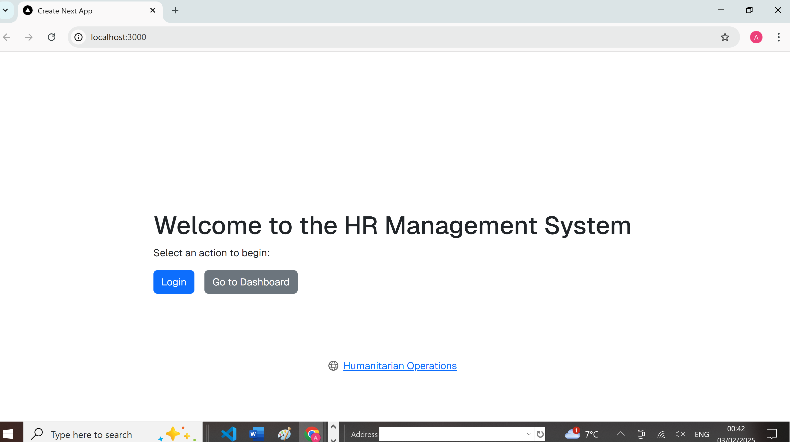

## Basic Internal HR System
This is a full-stack Human Resources (HR) Management System. The system allows for employee management, user authentication, and role-based access control.

## Features
User Authentication: Secure login using JWT tokens.
Role-Based Access Control: Admin users can manage employees.
Employee Management: Add, update, delete, and view employees.
Frontend: Developed with Next.js and React for a modern and responsive UI.
Backend: Node.js and Express handle business logic and API endpoints.
Database: PostgreSQL stores user and employee data securely.
Password Security: User passwords are hashed using bcrypt.

## Tech Stack
Frontend
    Framework: Next.js (React)
    Languages: TypeScript, JavaScript
    Styling: Bootstrap (for responsive design)
Backend
    Framework: Node.js with Express
    Authentication: JSON Web Tokens (JWT)
    Password Hashing: bcrypt
Database
    Type: PostgreSQL
    Tables:
        users: Stores user information and roles.
        employees: Stores employee details.

## Database Schema
users
    Column	    Type	    Description
    id	        SERIAL	    Primary Key
    name	    TEXT	    User's name
    email	    TEXT	    User's email (unique)
    password	TEXT	    Hashed password (bcrypt)
    role	    TEXT	    User role (ADMIN, etc.)

employees
    Column	    Type	    Description
    id	        SERIAL	    Primary Key
    name	    TEXT	    Employee's name
    email	    TEXT	    Employee's email
    position	TEXT	    Employee's position
    department	TEXT	    Department 
    salary	    NUMERIC	    Salary

## Setup Instructions
Prerequisites:
    Node.js (v14 or higher)
    PostgreSQL
    npm 

Backend Setup:
    Navigate to the backend folder:cd hr-backend
    Install dependencies:npm install
    Create a .env file in the hr-backend folder with the following:
        PORT=5000
        DATABASE_URL=postgres://<username>:<password>@localhost:5432/internal_hr_system
        JWT_SECRET=<your_jwt_secret>
    Start the backend server:node server.js

Frontend Setup:
    Navigate to the frontend folder:cd hr-frontend
    Install dependencies:npm install
    Start the development server:npm run dev
    Open your browser and navigate to http://localhost:3000

## Endpoints
Authentication
    POST /api/auth/login: Authenticate a user and return a JWT token.
Employee Management (Admin Only)
    GET /api/employees: Fetch all employees.
    POST /api/employees: Add a new employee.
    PUT /api/employees/:id: Update employee details.
    DELETE /api/employees/:id: Delete an employee.

## Screenshots
Home Page
    A landing page with options to log in or navigate to the dashboard.
    
Login Page
    Secure login form for user authentication.
    
Dashboard
    An interface for admins to manage employees:
        View a list of employees.
        Add, edit, or delete employee records.
    

## Known Issues
Ensure the .env file is properly configured for both frontend and backend before running.
Database must be seeded with at least one ADMIN user to access the dashboard.
